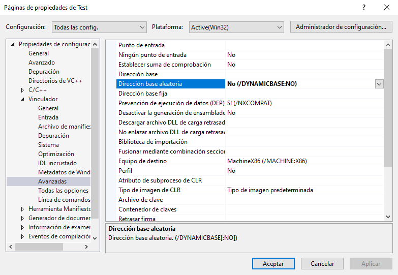
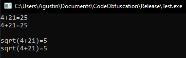
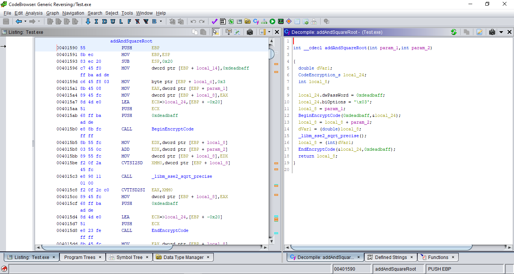
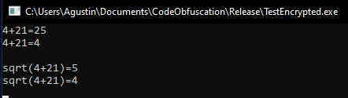
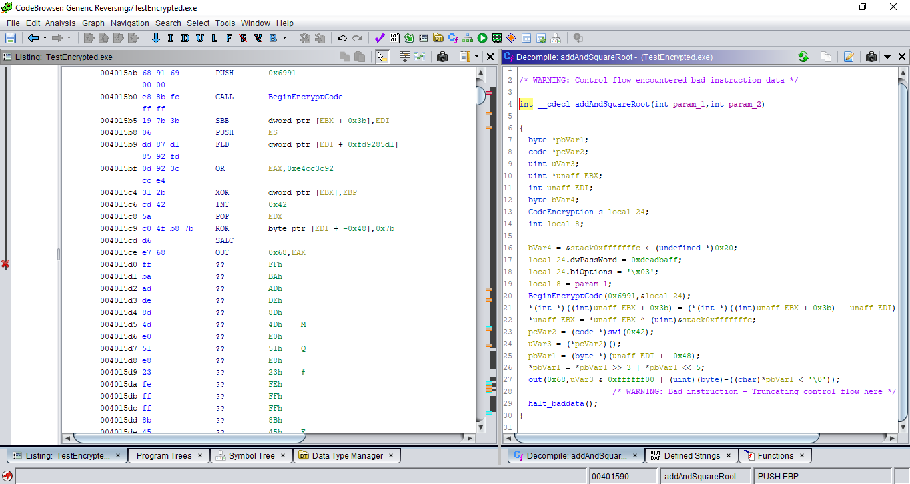

# Code Obfuscation
Code Obfuscation or Code Encrypt is a project which emulate ENCRYPT and CLEAR macros behavior from older Oreans's protections software. I originally developed this in 2014 but I recently decided to release as free and open source software.

## Pros
+ Encrypts all the code sections available inside the functions markers.
+ Destroy and Clear code if the clear flag is enabled.

## Cons
+ Requires disabling [ASLR](https://en.wikipedia.org/wiki/Address_space_layout_randomization) and only works in executables only.

## TODO
Fix and improve the BeginEncrypt and EndEncrypt functions detections.

# Demo
First make sure to disable ASLR (Properties -> Linker -> Advanced -> Dynamic base -> NO)

## Test
The original output:

The original reverse engineered code:

## Test Encrypted
The encrypted output:

The encrypted reverse engineered code:

B#